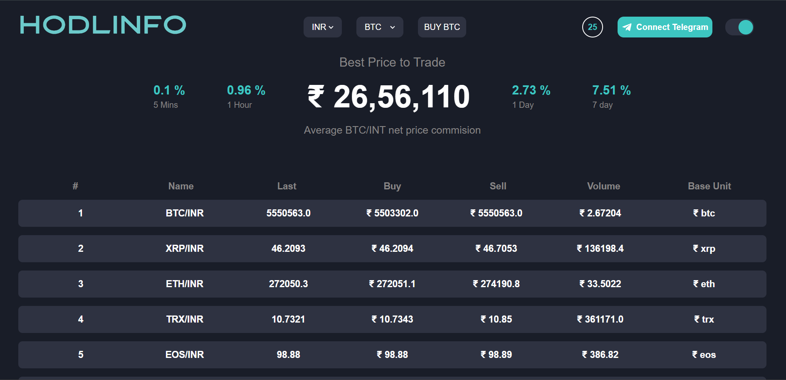

# QuadB Technologies Assignment

## Table of Contents

Technologies

Installation

Packages

### Technologies

1. Frontend : React.js and Tailwind CSS
2. Backend  : Node.js and Express.js
3. Database : MongoDB

## Installation

To run this project locally, follow these steps:

### Frontend

1. Clone this repository to your local machine.
2. Navigate to the project directory.
3. CD /client  
4. Run npm install to install dependencies
4. Run npm dev to start the development server.
6. Open your web browser and go to http://localhost:5173 to view the website.

### Backend 

1. Clone this repository to your local machine.
2. Navigate to the project directory.
3. CD /server  
4. Run npm install to install dependencies
5. Run nodemon index.js to start the development server.
6. Open your web browser and go to http://localhost:8000 for default route.

### Packages

1. express
2. dotenv
3. mongoose
4. nodemon
5. node-fetch

## User Interface

